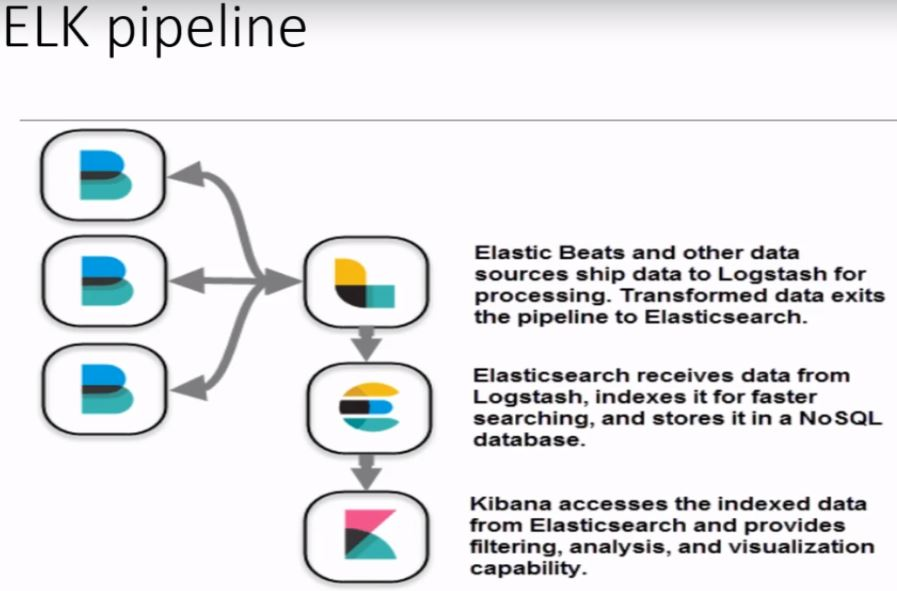

Basado en https://www.udemy.com/course/terraform-indepth-with-7-realtime-casestudies/learn/lecture/11064216#questions

The ELK stack is an acronym used to describe a stack that comprises of three popular open-source projects: Elasticsearch, Logstash, and Kibana. Often referred to as Elasticsearch, the ELK stack gives you the ability to aggregate logs from all your systems and applications, analyze these logs, and create visualizations for application and infrastructure monitoring, faster troubleshooting, security analytics, and more.

¿Porque usar ELK?
- Cada servidor puede tener un formato de logs
- Cada servidor guarda sus logs en local

Componentes ELK:
- Elasticsearch: es un motor de busqueda basado en NoSQL.
- Logstash: es un agregador de logs capaz de filtrar datos desestructurados de diferentes fuentes
- Kibana: es una herramienta de visualizaion tipo graphana.
- Filebeat: file shipper ligero con soporte SSL y TLS

En este ejemplo vamos a crear:
- 1x resouce group con sus reglas (elasticsearch.tf)
- 1x instancia con postproceso mediante provisiones de tipo 'file' y 'remote-exec' (elasticsearch.tf) en el cual:
  -- Preconfiguraremos Elasticsearch, Kibana, Logstash
  -- Instalaremos Elasticsearch, Kibana, Logstash y Filebeat (elasticsearch.sh)
- 1x Elastic IP para la instancia (elasticsearch.tf)

Ejecutar:
- terraform apply en /exec

