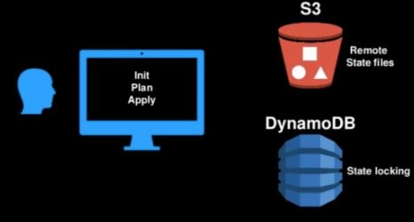

Basado en https://www.udemy.com/course/terraform-indepth-with-7-realtime-casestudies/learn/lecture/11073124#questions

Los '<b>state files</b>' (.tfstate) continen el estado de los recursos desplegados con terraform y tambien contienen:
- dependencias entre recursos
- Config de los recursos
- Mejorar el performance cacheando el valor de los atributos

Si se pierde el state file no se sabe en que estado estaran los recursos y hay que intentar que todas las modificaciones se hagan con Terraform en lugar del 'dashboard'.

Si se hace una modificación 'a mano' Terraform no lo sabra, pero se puede hacer un 'terraform refresh' para que el state file represente la nueva realidad. Siempre antes de hacer un 'destroy' hace un 'refresh'.

Si dos personas trabajan en el mismo plan de Terraform, Terraform bloquea el 'state file' y al segundo le dirá que esta en estado: 'state lock temporally unavailable'.

Si movemos un .tf o lo borramos, Terraform creera que ya no lo neceistamos y lo borrara en el siguiente 'terraform apply'

<b>Remote state</b>: otra aproximación es almacenarlos en un repo externo (como un S3 bucket debido a que gestiona versiones y esta encriptado), si adicionalemente usamos DynamoDB evitaremos el 'state lock'.

Para <b>almacenar los state files en el bucket S3</b>, hemos de poner este código:

  terraform {
    backend "s3" {
      bucket = "nombre del bucket donde guardar"
      ....

Una vez almacenado remotamente podemos leer el state file con 'terraform state pull'

 
