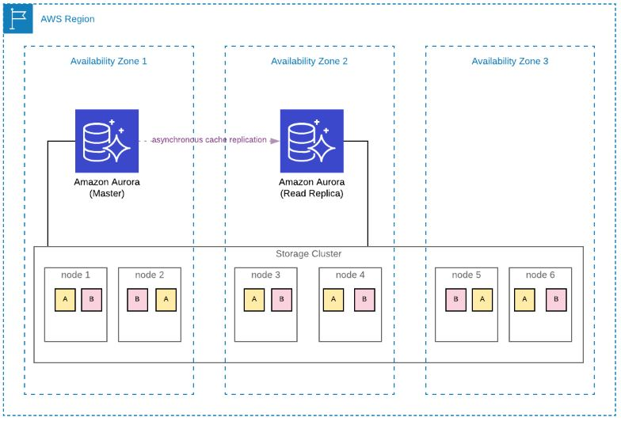
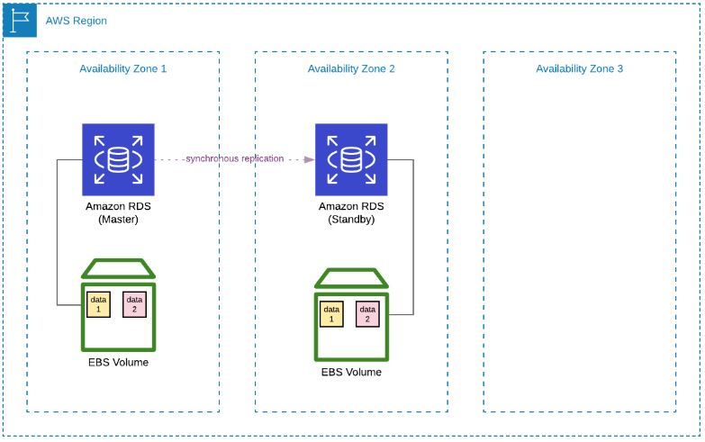

Basado en https://www.udemy.com/course/terraform-indepth-with-7-realtime-casestudies/learn/lecture/11140156#questions

**Amazon Aurora** es un DBaaS cloud services sobre MySQL o PostgreSQL. Aurora forma parte del servicio de bases de datos administradas Amazon Relational Database Service (Amazon RDS). Recomendado para alto performance y muy seguro debido a las 6 copias que distribuye en 3 zonas de disponisblidad diferentes. Minimo en 2 AZs.
Aurora’s unique storage design provides many advantages when compared to community edition RDS databases. Although there is a small increase in hourly bills when compared to RDS, I highly recommend using it for your enterprise-level applications.
Aurora provides more reliability in terms of storage. Its database storage is separate from the instances. In Aurora, your data has 6 copies as 10GB chunks distributed to 3 Availability Zones. Hence, even if you have only one Aurora instance, your data will still have 6 copies.

**Benificios**
- Hasta 5x veces mas potente gracias al log-based-storage
- es una arquitectura sin apenas lag de replicación
- Multi AZ (availability zone) deploy
- Backup automáticos
- Si necesita espacio se extiende automáticamente, hasta 64Tb.
- Autoscaling
- Escribir en MySQL implica: 1º escribir en log, 2º escribir en binlog, 3º escribir en FRM, 4º doble escritura en buffer. Aurora directamente escribe en el almacenamiento (log-based-storage) no en ficheros.
- Failover minimo comparado con el de MySQL.

**Prerequisitos**
- 1x subnet group #en este ejemplo ya estaba creado dentro de Amazon RDS y le asignamos en terraform.tfvars => DB_SUBNET_GROUP_NAME
- 1x security group #en este ejemplo ya estaba creado dentro de Amazon y le asignamos en terraform.tfvars => VPC_SECURITY_GROUP_IDS

**Componentes del despliegue**
- 1x aws_rds_cluster
- 2x aws_rds_cluster_instance: 1 Master + 1 Read replica => INSTANCE_COUNT_IN_CLUSTER
Parametros:
- numero de backup: en aurora.tf => backup_retention_period
- ventana de backup: en aurora.tf => preferred_backup_window

<h2> Arquitectura Aurora</h2>
 

<h2> Arquitectura RDS</h2>
 
