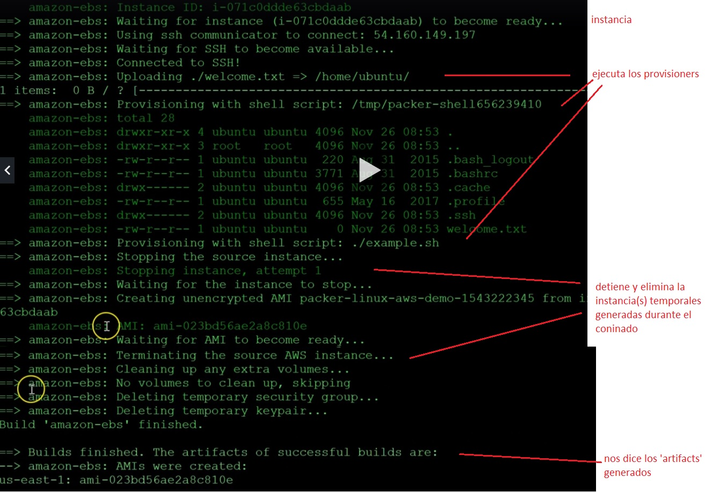

Basado: https://www.udemy.com/course/terraform-indepth-with-7-realtime-casestudies/learn/lecture/12782821#questions

**Que es Packer**
- Packer sirve para plataformar imágenes antes de desplegarlas
- Packer is an open source tool for creating identical machine images for multiple platforms from a single source configuration.
- A machine image is a single static unit that contains a pre-configured operating system and installed software which is used to quickly create new running machines. Machine image formats change for each platform. Some examples include AMIs for EC2, VMDK/VMX files for VMware, OVF exports for VirtualBox, etc.
- Las platillas son archivos JSON.

**Packer pipeline**
Packer + Provisioners (de tipo fichero, shell o Ansible playbooks) = Imagen ----> Terraform para desplegarla.

Packer construye imagenes con Baking o Frying.
  - Baking usa Packer para construir el upfront. Ahorra tiempo y permite el versionado.
  - Frying: crea la imagen en el arranque usando datos del usuario o provisioners.

**Componentes de un Packer**
- Variables
- Builders
- Provisioners: mediante SSH o Ansible provisionamos los recursos
- Post-processors

**Packer en 2 pasos**
1º VALIDATE, valida el código, ejemplo: packer validate test1.json
2º BUILD, ejemplo: packer build test1.json. Durante el BUILD Packer hace el despliegue termporal que luego elimina. Es lo que se conoce como 'cocinar o baking', BUILD hace el proceso para generar ya todos los ARTIFACTS que sean necesarios en futuros depsliegues.

ARTIFACTS: son los assets necesarios creados durante el BUILD, por ejemplo al hacer un packer AWS, el BUILD generará el AMI (código de instancia personalizada para su posterior despliegue n veces)

Con Terrafor pediremos desplegar el AMI id (código de imagen personalizada) ya generado.

