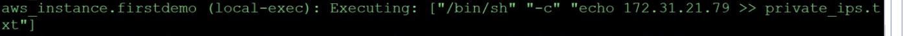
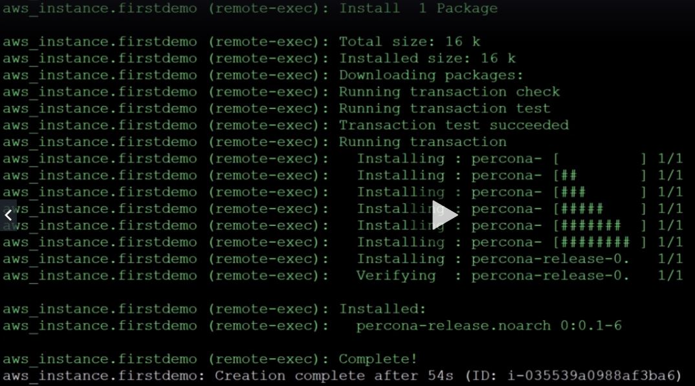

Basado en https://www.udemy.com/course/terraform-indepth-with-7-realtime-casestudies/learn/lecture/11073128#questions

Provisioners: Para ejecutar comandos locales o remotos para configurar servidores una vez desplegados. Tambien se pueden invocar Ansible playbooks para alcanzar la configuración deseada.

Tipos:
- <b>local-exec</b>: ejecutados en local
- <b>file</b>: copiar archivos o contenido a archivos desde local a la instancia desplegada
- <b>remote-exec</b>: ejecutados en la instancia desplegada
- <b>Null resource</b>: aquellos no asociados a una instancia concreta, genéricos
- <b>Chef</b>: u otra herramienta de terceros de provisioner.

1º - Ejemplo de <b>local-exec</b>: 

2º - Ejemplo de <b>remote-exec</b>: 

3º - Ejemplo de provisioner de tipo <b>file</b> y <b>null resource</b>: copia de un archivo a un entorno ya desplegado
