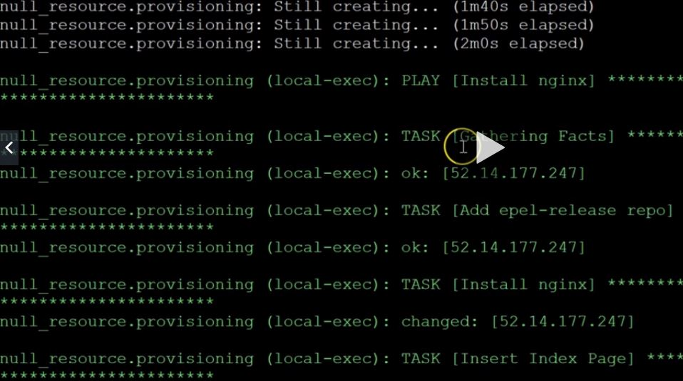

Basado en https://www.udemy.com/course/terraform-indepth-with-7-realtime-casestudies/learn/lecture/12782747#questions

**Ansible**: Plataforma de software libre para configurar y administrar ordenadores, ejecuciones de tareas ad hoc y administración de configuraciones. Adicionalmente, Ansible es categorizado como una herramienta de orquestación. Gestiona nodos a través de SSH y no requiere ningún software remoto adicional (excepto Python 2.4 o posterior) para instalarlo. Dispone de módulos que trabajan sobre JSON. Nativamente utiliza YAML para describir configuraciones reusables de los sistemas.

------------

**Comandos basicos**:
- _ansible --help_
- _ansible --version_
- _ansible --list-hosts all_    #ver todos los hosts que Ansible tiene inventariados
- _ansible --list-hosts webservers_    #ver todos los hosts que Ansible tiene inventariados como webservers

Inventario: /etc/ansible/hosts donde poner los servidores agrupados por rol (webservers, dbservers, ...)

Ejemplos de comandos:
 Nota1: si no usamos el -m es que estamos usando el modulo command
 Nota2: -a son los argumentos del comando
- _ansible webservers -a uptime_    #Aqui ejecutamos en todos los webservers el comando uptime. es equivalente a -m command -a uptime
- _ansible all -m ping_   #usar el modulo ping contra todos los hosts del inventario (y ver que servidores estan levantados)
- _ansible-doc -l_    #listar modulos preinstalados
- _ansible-doc -l | grep -i netapp_  #ver modulos preinstalados con la descripcion 'netapp'
- _ansible-doc azure_rm_storageblob_  #ver la documentacion de un modulo concreto
- _ansible all -a "yum -y install httpd"_   #instalar a todos el paquete httpd
- _ansible &#42;*APP&#42; -m copy -a "src=/temp/archivo.txt dest=/tmp/archivo1.txt"_   #usar el modulo copy para copiar un archivo a todos los servers &#42;APP&#42;

------------

**Playbook**: un conjunto de tareas a ejecutar en orden. Ej: instalar nginx y luego configurarlo y luego arrancarlo.

En este ejemplo usaremos Terraform con Ansible para desplegar una instancia y luego con un provisioner 'local-exec' llamar a un playbook de ansible

