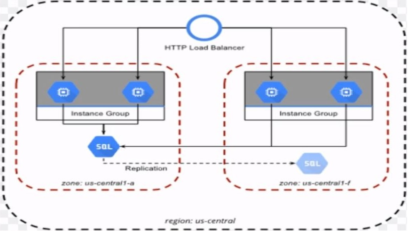

Basado en https://www.udemy.com/course/terraform-indepth-with-7-realtime-casestudies/learn/lecture/11148044#questions

**Demo: Weapp stack**
En este ejemplo con GCP desplegaremos una webapp compuesta de:
- 1x balanceador HTTP (load_balancer.tf)
- 1x instance_group + nx instancias + opciones de Autoscaling (instance_group.tf + instance template.tf)
- 1x google_sql_database_instance 'Master' + 1x google_sql_database_instance 'Replica' (sql.tf)
- 1x VPC network (network.tf)
- Reglas de firewall (firewall.tf)
- ejecutaremos scripts postproceso sobre las instancias una vez desplegadas (userdata.sh)

**Compute engine**
El equivalente a 'Instances' de AWS. Demo en: https://www.udemy.com/course/terraform-indepth-with-7-realtime-casestudies/learn/lecture/11064116#questions
Semejanzaas: igualmente dependen de una región y zona, puedes usar metadatos, usar imagenes preconfiguradas o crear las tuyas propias.
Diferencias: en GCP necesitamos un 'boot disk' para arrancar el OS.
Almacenamiento para máquinas: en Amazon se llaman volumenes EBS, en GCP 'persistent disk'

**VPC**
Virtual Private Cloud. Pueden ser manuales o automaticas. Demo en: https://www.udemy.com/course/terraform-indepth-with-7-realtime-casestudies/learn/lecture/11064126#questions
Semejanzas: cada recurso pertenece a un VPC
Diferencia: en GCP la VPC es global por defecto, en AWS es regional

**Load balancer**
Pueden ser de tipo HTTP, HTTPS, TCP o UDP. Se compone de un frontend (Anycast IP) y un backend (instance_group) opciones de Autoscaling y el healthcheck. Tambien hay balanceadores para streaming de audio/video.
Demo en: https://www.udemy.com/course/terraform-indepth-with-7-realtime-casestudies/learn/lecture/11064132#questions

**CloudSQL**
Basado en MySQL o Postgresql. Teoria en: https://www.udemy.com/course/terraform-indepth-with-7-realtime-casestudies/learn/lecture/11064138#questions
Demo en: https://www.udemy.com/course/terraform-indepth-with-7-realtime-casestudies/learn/lecture/11064142#questions
Despliegue con Terraform en sql.tf
