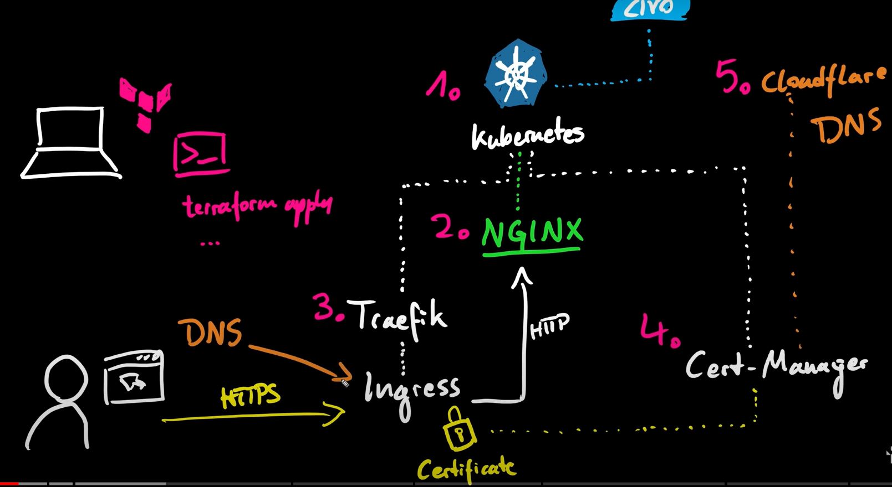

[![LinkedIn][linkedin-shield]][linkedin-url]

<!-- PROJECT LOGO -->
 

  

  <h3 align="center"><!-- TITULO -->Terraform + Kubernetes + HELM + Traefic + CLoudflare + NGNIX</h3>

  

    <!-- DESCRIPCION -->Basado en
    Faltaria el archivo 'credentails.auto.tfvars' con las credenciales privadas <a href="https://www.youtube.com/watch?v=kFt0OGd_LhI"><strong>Caso 2022</strong></a>
  

## PROYECTO

  <b>Cluster Terraform de 2 nodos con HELM para desplegar aplicativos, Traefic de balanceador, Cloudflare de DNS y Nginx de Web server:</b>
  ver este proyecto <a href="https://www.youtube.com/watch?v=kFt0OGd_LhI" target="_blank">AQUÍ</a>
  <ul style="padding-left: 10%">
    <li>Un Cluster Kubernetes de 2 nodos</li>
    <li>HELM</li>
    <li>Traefic</li>
    <li>CloudflareDNS</li>
    <li>Nginx</li>
  </ul>

 

img src="1_Kubernetes_Size.JPG" alt="Terraform+Kubernets" width="600" >    

### Built With
<!-- TECNOLOGIAS -->
* IaC: Terraform
* Kubernetes

## Getting Started
---

### Prerequisites
---

### Installation
---

## Usage
---

## Roadmap
---

## Contributing
Contributions are what make the open source community such an amazing place to be learn, inspire, and create. Any contributions you make are **greatly appreciated**.

1. Fork the Project
2. Create your Feature Branch (`git checkout -b feature/AmazingFeature`)
3. Commit your Changes (`git commit -m 'Add some AmazingFeature'`)
4. Push to the Branch (`git push origin feature/AmazingFeature`)
5. Open a Pull Request

## License
Distributed under the MIT License. See `LICENSE` for more information.

[linkedin-shield]: https://img.shields.io/badge/-LinkedIn-black.svg?style=flat-square&logo=linkedin&colorB=555
[linkedin-url]: https://linkedin.com/in/sergioalegre
